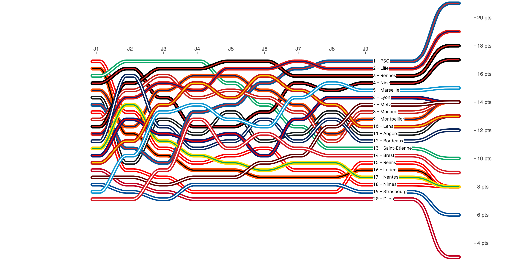

# Hi, I'm Nicolas Mondon, software engineer and data journalist based in Paris

I'm mostly doing quantitative analysis and data visualisations.
For this, I use lots of:

- Python (pandas, numpy, scikit-learn, jupyter, spacy) and node.js (puppeteer) for scraping and data analysis (statistics, NLP, machine learning)
- Typescript, React, Svelte, d3, SVG, canvas, WebGL, topojson, RxJS or firebase for data visualisations

But a part of my job is also to industrialize and build tools to improve our processes, reuse components through dedicated libraries or scaffolders.

## Here is a short selection of recent projects I've made:

#### [Municipales 2020 : les résultats pour les villes de plus de 3 500 habitants](https://www.lefigaro.fr/fig-data/municipales-2020-live-t2/)

- a live dashboard for the french local elections
- design, implementation (including a routine to retrieve and process the data)

#### [Qui peut remporter le second tour des municipales dans votre commune?](https://www.lefigaro.fr/fig-data/municipales-2020-fusions/)

- a search engine to analyse political alliances
- processing, design, implementation

#### [Votre département a-t-il enregistré une surmortalité importante ?](https://www.lefigaro.fr/fig-data/coronavirus-surmortalite/)

- processing + design + implementation

#### [De l’élégance noire à l’audace du néon : quand les couleurs racontent la mode](https://www.lefigaro.fr/fig-data/couleur-defiles/)

- for this piece, I've analyzed thousands of images from fashion collections with a tensorflow model to extract silhouettes. Then I've used a quantization algorithm to get color palettes for each brand. Finally, I build a scrollytelling visualization with arcs patterns to show the generated palettes.

#### [Ligue 1 ranking](https://serac.io/2020-evolution-ranking)

- a tool to visualize the evolution of Ligue 1's ranking, made in d3

* [Construisons un modèle épidémiologique](https://www.lefigaro.fr/fig-data/modele-compartimental/)
* [Le confinement a-t-il permis d’endiguer le nombre des décès ?](https://www.lefigaro.fr/fig-data/bilan-confinement/)
* [Quelles études ont fait nos ministres ?](https://www.lefigaro.fr/fig-data/etudes-gouvernement/)
* [Qui pourraient être les 5 eurodéputés «réservistes» ?](https://www.lefigaro.fr/fig-data/eurodeputes-reservistes/)
* [Votre commune a-t-elle un problème avec sa dette ?](https://www.lefigaro.fr/fig-data/dette-commune/)
* [Votre ville est-elle un bastion de la droite ou de la gauche ?](https://www.lefigaro.fr/fig-data/bastions/)
* [La République en Marche face à la dispersion de sa majorité](https://www.lefigaro.fr/fig-data/lrem-dispersion/)
* [Ces Européens qui siègent dans nos mairies](https://www.lefigaro.fr/fig-data/europeens-elus-en-france/)
* [Qui sont les barons locaux de votre département ?](https://www.lefigaro.fr/fig-data/longevite-maires/)

* [Vincent Lambert : du cas à l'affaire hors normes](https://www.lefigaro.fr/fig-data/vincent-lambert/)
* [Tous les matchs de l'équipe de France en un graphe](https://serac.io/matchs-edf/)

## I'm also doing OSS, here are some of my projects:

- [kohonen](https://github.com/seracio/kohonen): a JS implementation of the SOM algorithm
- [fulgur](https://github.com/seracio/fulgur): A declarative vis library in React I'm working on
- [plugnplay](https://github.com/seracio/plugnplay): A store for React based on RxJS that I use in each one of my React projects
